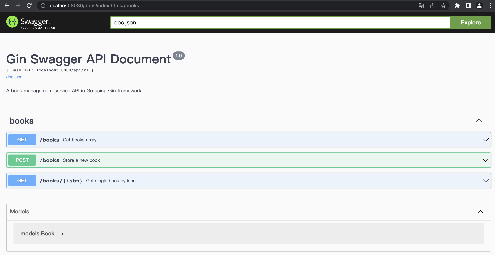

# golang_gin_swagger

## install Swagger CLI

```shell
# 1.16 or newer
go install github.com/swaggo/swag/cmd/swag@latest
```

## get packages

```shell
go get -u github.com/swaggo/files
go get -u github.com/swaggo/gin-swagger
```

## Generate swagger docs every time you modify doc string

```shell
swag init
```



